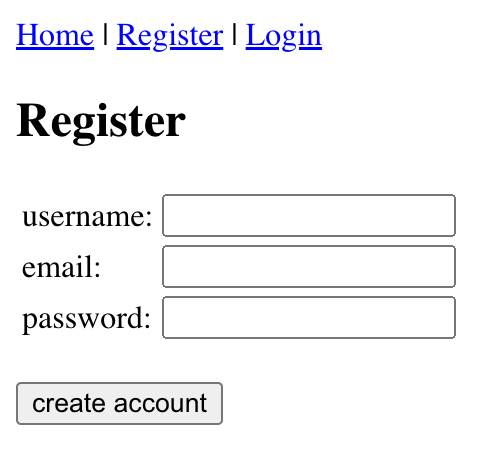

# Vue 3 Token Authentication

> For demonstration purpose only



Vue 3 Token Authentication example.

Uses:
* No CSS / pure HTML (except for errors 😬)
* [Vue 3](https://vuejs.org/) using [Options API](https://vuejs.org/guide/introduction.html#api-styles) (no Composition API)
* [Vue Router 4](https://router.vuejs.org/)
* [Vuelidate](https://vuelidate-next.netlify.app/) for client-side form validation
* Storage using [Pina](https://pinia.vuejs.org/) and [localStorage](https://developer.mozilla.org/fr/docs/Web/API/Window/localStorage)
* No [setup()](https://vuejs.org/api/composition-api-setup.html) usage (except for Vuelidate 😬)
* Fake token authentication using [Express Fake Token Auth](https://github.com/cba85/express-fake-token-auth-api) on `http://127.0.0.1:3000` url

4 pages (views) using Vue Router:
* `/` : home (public)
* `/login`: login form (guest only)
* `/register`: register form (guest only)
* `/account`: private page (auth only)

Actions:
* (manually) logout button

## Project Setup

```sh
npm install
```

### Compile and Hot-Reload for Development

```sh
npm run dev
```

### Compile and Minify for Production

```sh
npm run build
```
